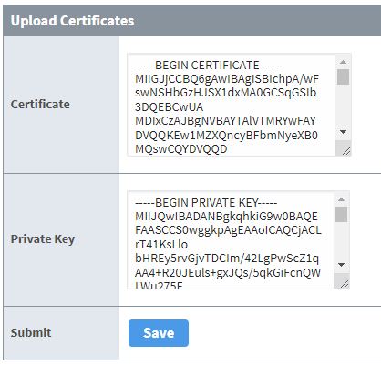

# API Client Module 

An Ignition module that provides an easy way to interface with REST APIs without having to write scripts in Ignition. The module allows you to specify the interaction with an API through a configuration YAML. The YAML configuration is designed to be portable for easy sharing. All sensitive information related to the API is stored and protected in Ignition's internal database as encrypted variables. The module will perform the REST calls, parse the response, and execute actions to store data to Ignition tags, invoke other APIs, or handle the response with a Python script. 

The API Client Module provides support for:

1. All HTTP methods (GET, POST, PUT, DELETE, HEAD, PATCH)
2. HTTPS with the ability to disable certificate verification (if needed)
3. Execute manually, on a timer, through a cron schedule, or triggered from an Ignition tag
4. Multiple authentication types (Bearer, Basic Auth, Session Auth, OAuth2)
5. JSON and JSON path support
6. Write results to tags provided by the module in a realtime tag provider called `API`
7. Webhooks or callbacks to push data to Ignition without having to poll for data. Requires Ignition to be exposed to the internet.

Open Source
---------------

The API Client Module is an open source project distributed under the Apache 2.0 license. Please feel free to download the source code and contribute.

Getting Started
---------------

1. Download the latest version module (.modl) from [releases](https://github.com/Kyvis-Labs/ignition-api-client-module/releases)
2. Install the module into Ignition 8.1+
3. Log into the Ignition Gateway configuration page
4. Click on `API > APIs` from the menu
5. Add a new API configuration. Provide the API a name and configuration YAML. Example YAML configurations are found [on GitHub](https://github.com/Kyvis-Labs/API-YAML).
6. If the configuration requires sensitive data, such as a username or password, you will need to provide the data by clicking on `More > variables` for that API. 
<br/>
7. If the configuration requires OAuth2 flow, you will need to click on `More > oauth2` for that API.
8. Enjoy!

# YAML Documentation

The API Client Module uses the [YAML](https://yaml.org/) syntax for configuration. Each API is represented by YAML configuration that specifies how to interface with the 3rd party API. The configuration defines the endpoints, authentication method, interactions with Ignition, and more. YAML might take a while to get used to but is really powerful in allowing you to express complex configurations.

The basics of YAML syntax are block collections and mappings containing key-value pairs. Each item in a collection starts with a  `-`  while mappings have the format `key: value`. This is somewhat similar to a Hash table or more specifically a dictionary in Python. These can be nested as well.  **Beware that if you specify duplicate keys, the last value for a key is used**.

Note that indentation is an important part of specifying relationships using YAML. Things that are indented are nested “inside” things that are one level higher. Getting the right indentation can be tricky if you’re not using an editor with a fixed width font. Tabs are not allowed to be used for indentation. Convention is to use 2 spaces for each level of indentation.

You can use the online service  [YAMLLint](http://www.yamllint.com/)  to check if your YAML syntax is correct before loading it into the module which will save you some time. If you do so, be aware that this is a third-party service and is not maintained by the API Client Module.

> **Note:** Please pay attention to not storing private data (passwords, API keys, etc.) directly in your YAML configuration. Private data is stored through variables. Variables are stored inside of Ignition's internal database with encryption.

Strings of text following a  `#`  are comments and are ignored by the system.

# Example Configuration

Here is an example YAML configuration for an API. This example gets data from Open Weather Map. The API defines 2 variables that must be entered by the user, `appId` and `cityId`, since they are different for each user and are sensitive data. There are 2 API functions that are called, `currentWeather` and `forecast`. The current weather function runs every 5 minutes, gets the current weather, and stores the result in tags. The forecast function does the same but gets 5-day forecasts.

```yaml
version: 1

api:
  name: OpenWeatherMap
  description: Interfaces with OpenWeatherMap for current and forecast data
  version: 1.0.0
  author: 
    name: Travis Cox
    email: travis@kyvislabs.com
    url: https://github.com/Kyvis-Labs/API-YAML/OpenWeatherMap
    
variables:
  appId:
    required: true
  cityId:
    required: true
  baseUrl:
    default: https://api.openweathermap.org/data/2.5
    hidden: true
  
functions:
  currentWeather:
    url: "{{var::baseUrl}}/weather"
    method: get
    params:
      - name: appid
        value: "{{var::appId}}"
      - name: id
        value: "{{var::cityId}}"
      - name: units
        value: imperial
    schedule:
      type: timer
      duration: 5
      unit: minutes
    actions:
      - action: tag
        path: "{{var::apiName}}/data/current"
        type: jsonExpand
  forecast:
    url: "{{var::baseUrl}}/forecast"
    method: get
    params:
      - name: appid
        value: "{{var::appId}}"
      - name: id
        value: "{{var::cityId}}"
      - name: units
        value: imperial
    schedule:
      type: timer
      duration: 5
      unit: minutes
    actions:
      - action: tag
        path: "{{var::apiName}}/data/forecast"
        type: jsonExpand
```

# Configuration Parameters

There are 7 top level configuration parameters that define an API: 

- [version](#version)
- [api](#api)
- [session](#apisession)
- [httpsVerification](#httpsverification)
- [httpsCertificates](#httpscertificates)
- [variables](#variables)
- [authType](#authtype)
- [headers](#headers)
- [webhooks](#webhooks)
- [functions](#functions)

## version

The YAML configuration will go through many iterations. Versioning is critical. This allows you to specify the version of the YAML so the module knows what to expect.

### Parameters

**version** integer *(required)*
The version of the YAML. Defaults to 1.

### Example

```yaml
version: 1
```

## api

The api section describes the API, version, and author. This section will be used in the future to browse for example YAML configurations from GitHub.

### Parameters

**name** string *(required)*
The public name of the API.
___
**description** string *(required)*
The public description of the API.
___
**version** string *(required)*
The version of the YAML configuration.
___
**author** [author](#author) *(required)*
Describes the author of the YAML configuration.

### Example

```yaml
api:
  name: MyAPI
  description: Interfaces with MyAPI 
  version: 1.0.0
  author: 
    name: John Doe
    email: john@acme.com
    url: https://github.com/JohnDoe
```

## author

Describes the author of the YAML configuration.

### Parameters

**name** string *(required)*
The author's name.
___
**email** string *(optional)*
The author's email.
___
**url** string *(optional)*
The URL to the author's page.

## session (persistent session)<span id="apisession"><span>

Some APIs require persistent sessions and will provide cookies that must be used in each call. You can enable this feature by setting this parameter to true. Leaving this setting out is the same as setting the value to false.

### Parameters

**session** boolean *(optional)*
Whether to enable a session

### Example

```yaml
session: true
```

## httpsVerification

Some https sites do not have a trusted HTTP certificate resulting in an exception with the request. You can disable HTTPS certificate verification by setting this parameter to false. Leaving this setting out is the same as setting the value to true.

### Parameters

**httpsVerification** boolean *(optional)*
Whether to enable HTTPS verification

### Example

```yaml
httpsVerification: false
```

## httpsCertificates

Optionally, you can add a custom additional keyStore that contains a X509 Certificate for ssl connection trust validation. If the value is true, you will need to upload the certificate and private key by clicking on the `More > certificate` link on the API. Leaving this setting out forces the API to use Ignition's truststore.

<br/>


### Parameters

**httpsCertificates** boolean *(optional)*
Whether to add a certificate for trust validation

### Example

```yaml
httpsCertificates: false
```

## variables

The variables section allows you to define any number of variables, defined as a named list, that can be used throughout the API. This avoids having to duplicate information on multiple endpoints and allows you to store sensitive data, such as passwords, without having to specify it in the YAML configuration. All variables are stored inside of Ignition's internal database with encryption and are persistent. Variables can have a static value or require the user to set the value in the configuration section of Ignition's Gateway webpage. The API can't start until all required variables are set.

The variables section is optional. Leaving the section out results in no variables defined.

### Parameters

***variableName*** [variable](#variable) *(required)*
You can provide multiple variables. Each variable is unique by the name you provide. Replace *variableName* with the name of your variable. See example below that defines 1 variable called *baseUrl*.

### Example

```yaml
variables:
  baseUrl:
    default: https://api.rach.io/1/public
    hidden: true
```

## variable

Defines a variable to use throughout your API.

### Parameters

**required** boolean *(optional)*
Whether the variable is required to be set before the API can start.
___
**sensitive** boolean *(optional)*
Whether the variable is sensitive so it is not visible to the user. All variables are stored with encryption. However, variables that are not sensitive will be shown in the configuration, such as a URL.
___
**hidden** boolean *(optional)*
Whether the variable is allowed to be set. If true, the editor in the configuration will be disabled.
___
**uuid** boolean *(optional)*
Whether to generate a random UUID as the value of the parameter. Takes precedence over default.
___
**default** string *(optional)*
The default value for the variable. Useful for defining an initial value or static values.

## authType

The authType section allows you to define how to authenticate to the API. The module supports the following authentication types:

- None - No Authentication
- Bearer Token - Specify a bearer token.
- Basic Auth - Specify a username and password.
- Session Auth - Specify a username and password using a session. Session maintains cookies, basic auth and maybe other http context for you, useful when need login or other situations.
- Token Auth - Specify a URL to get authentication tokens that get stored as variables to use in subsequent calls.
- OAuth2 - Standard OAuth2 authentication flow.

The module assumes no authentication is required if the section not defined.

### Parameters

***type*** string *(required)*
The type of authentication to use. Possible values are:

- [none](#none)
- [bearer](#bearer)
- [basic](#basic)
- [session](#session)
- [token](#tokenauth)
- [oauth2](#oauth2)

Each type has its own set of parameters. See the types below for more details.

### Example

```yaml
authType: 
  type: session
  url: {{var::baseUrl}}/api/auth/login
  params:
    - name: remember
      value: true
```
  
## none

Specifies that the API requires no authentication. Default when authType is not defined in the YAML.

### Parameters

*None*

## bearer

Specifies that the API uses bearer tokens. Automatically adds the following variables that need to be set by the user:

 - `authType-bearer-token` 
 
### Parameters

*None*

## basic

Specifies that the API uses basic HTTP authentication. Automatically adds the following variables that need to be set by the user:

 - `authType-basic-username` 
 - `authType-basic-password` 

### Parameters

*None*

## session

Specifies that the API uses session based authentication. Session will post the username and password as JSON data to an endpoint and keep track of a session. Automatically adds the following variables that need to be set by the user:

 - `authType-session-username` 
 - `authType-session-password` 

### Parameters

**url** string *(required)* *([value string](#value-string))*
The URL to post the authentication data.
___
**params** list of [param](#param) *(optional)*
An array of parameters to include in the JSON body along with the username and password.

## token (auth)<span id="tokenauth"><span>

Specifies that the API uses token based authentication. Token will post the username and password as JSON data to an endpoint and store a list of tokens. Automatically adds the following variables that need to be set by the user:

- `authType-token-username`
- `authType-token-password`

### Parameters

**url** string *(required)* *([value string](#value-string))*
The URL to post the authentication data.
___
**headers** list of [header](#httpheader) *(optional)*
An array of headers to use with the token URL request.
___
**params** list of [param](#param) *(optional)*
An array of parameters to include in the JSON body along with the username and password.
___
**tokens** list of [token](#token) *(required)*
An array of token names to look for in the response. All of these tokens are stored as variables to use throughout the API.
___
**expiresIn** integer *(optional)*
The time in milliseconds before the token will expire.

## token

Represents a token used in authorization flows.

### Parameters

**name** string *(required)*
The token name.

## oauth2

Specifies that the API uses OAuth2 for authentication and authorization. The OAuth2 flow looks like this:

 - Obtain OAuth 2.0 credentials from your API. You need to specify the client id and secret as variables.
 - Obtain an authorization code your API's authorization server. You need to specify the authorization URL as a parameter in this section. Once you authenticate on the API side, you will be redirected back to Ignition with the authorization code. You need the code to obtain an access token.
 - Obtain an access token from your API's authorization server. You need to specify the access token URL as a parameter in this section.
 - Use the access token to subsequent API calls.
 - Refresh the access token after expiration, if necessary.

OAuth2 supports 3 different grant types:

 - Authorization Code - Used by confidential and public clients to exchange an authorization code for an access token. Most common.
 - Client Credentials - Used by clients to obtain an access token outside of the context of a user.
 - Password - A legacy way to exchange a user's credentials for an access token.

### Authorization Code

OAuth2 automatically adds the following variables that need to be set by the user:

 - `authType-oauth2-client-id` 
 - `authType-oauth2-client-secret`

Additionally, OAuth2 adds the following read-only variables for reference:

 - `authType-oauth2-auth-code` 
 - `authType-oauth2-access-token`
 - `authType-oauth2-token-type`
 - `authType-oauth2-expiration`
 - `authType-oauth2-refresh-token`

### Client Credentials

OAuth2 automatically adds the following variables that need to be set by the user:

- `authType-oauth2-client-id`
- `authType-oauth2-client-secret`

Additionally, OAuth2 adds the following read-only variables for reference:

- `authType-oauth2-access-token`
- `authType-oauth2-token-type`
- `authType-oauth2-expiration`
- `authType-oauth2-refresh-token`

### Password

OAuth2 automatically adds the following variables that need to be set by the user:

- `authType-oauth2-client-id`
- `authType-oauth2-username`
- `authType-oauth2-password`

Additionally, OAuth2 adds the following read-only variables for reference:

- `authType-oauth2-access-token`
- `authType-oauth2-token-type`
- `authType-oauth2-expiration`
- `authType-oauth2-refresh-token`

### Parameters

**authUrl** string *(required)* *([value string](#value-string))*
The authorization URL for your API to obtain the authorization code.
___
**scope** string *(required)*
The scope for the API. Sent in the authorization URL. See your API for more details.
___
**accessTokenUrl** string *(required)* *([value string](#value-string))*
The access token URL for your API to obtain the access token.
___
**headers** list of [header](#httpheader) *(optional)*
An array of headers to use with the access token URL request.
___
**accessTokenKey** string *(optional)* 
The key in the response that contains the access token. Defaults to *access_token*.
___
**grantType** string *(optional)*
The OAuth2 grant type. Possible grant types are:

 - authorizationCode
 - clientCredentials
 - password

Defaults to *authorizationCode*.
___
**randomUserAgent** boolean *(optional)*
Setting this to true will generate a random User Agent for the OAuth2 requests. Otherwise, you will need to provide a specific User-Agent header. Defaults to false.
___
**clientId** string *(optional)* *([value string](#value-string))*
The client id to use. Only specify if the client id is static and not specific to your account.
___
**clientSecret** string *(optional)* *([value string](#value-string))*
The client secret to use. Only specify if the client secret is static and not specific to your account.
___
**pkce** boolean *(optional)*
PKCE (RFC 7636) is an extension to the Authorization Code flow to prevent CSRF and authorization code injection attacks. Set to true if the API requires this extension. Defaults to false.
___
**authCode** boolean *(optional)*
When using PKCE, setting this to true will direct to you to login page where you will login and manually get the authorization code from the resulting redirect. You will enter the authorization code into the OAuth2 settings page. This is required when the API is trying to protect from bots accessing the API, usually for undocumented APIs. Defaults to false.
___
**usernameInput** string *(optional)*
When using PKCE, this is the form element name for the username.
___
**passwordInput** string *(optional)*
When using PKCE, this is the form element name for the password.
___
**redirectUrl** string *(optional)* *([value string](#value-string))*
When using PKCE, you can override the redirect URL required for the flow.
___
**twoFactor** boolean *(optional)*
When using PKCE, some APIs require 2-factor authentication. Set this to true so the API can ask for the 2-factor code sent to you when trying to authenticate. Defaults to false.
___
**captcha** boolean *(optional)*
When using PKCE, some APIs require CAPTCHA codes. Set this to true to present the CAPTCHA image, so you can enter the code presented. If set to true, you must provide a CAPTCHA URL. Defaults to false.
___
**captchaUrl** string *(optional)* *([value string](#value-string))*
When using PKCE and CAPTCHA, specify the URL to get the CAPTCHA image. Leave empty when not using CAPTCHA.
___
**bearerAccessTokenUrl** string *(optional)* *([value string](#value-string))*
Some APIs require an additional step to get the BEARER token after the OAuth2 flow. If required, provide the additional URL to access the token. Leave empty if not required.
___
**bearerClientId** string *(optional)* *([value string](#value-string))*
If using an additional BEARER token, specify the client id to use. Leave empty if not required.
___
**bearerClientSecret** string *(optional)* *([value string](#value-string))*
If using an additional BEARER token, specify the client secret to use. Leave empty if not required.
___
**bearerGrantType** string *(optional)*
If using an additional BEARER token, specify the grant type.

## headers

The headers section allows you to define HTTP headers for all endpoints globally. For example, all endpoints may require a specific content type that you can define globally versus every single endpoint. This is represented as an array of header key value pairs.

### Parameters

Array of [header](#httpheader)

### Example

```yaml
headers:
  - key: Content-Type
    value: application/json
```

## header (HTTP)<span id="httpheader"><span>

Represents a header (key value pair) used as HTTP headers.

### Parameters

**key** string *(required)*
The header name.
___
**value** string *(required)* *([value string](#value-string))*
The header's value.

## webhooks

The webhooks section allows you to define webhooks or custom callbacks in Ignition. Webhooks provide a way for an app to provide Ignition with real-time information using a push mechanism without having to poll for data, resulting in efficient transfer of data. Webhooks add servlets to Ignition that receive the callback. Webhooks only accept HTTP post data.

The webhooks section is optional. Leaving the section out results in no webhooks defined.

### Parameters

***webhookName*** [webhook](#webhook) *(required)*
You can provide multiple webhooks. Each webhook is unique by the name you provide. Replace *webhookName* with the name of your webhook. See example below that defines 1 webhook called *device*.

### Example

```yaml
webhooks:
  device:
    check:
      url: {{var::baseUrl}}/notification/webhook/{{var::webhook.id}}
      method: get
    add:
      depends: person
      url: {{var::baseUrl}}/notification/webhook
      method: post
      body:
        type: json
        value: |
          {"device":
            {"id":"{{var::person.deviceId}}"}, 
            "url":"{{var::webhook.url}}",
            "eventTypes":[{"id":"5"}]
          }
      actions:
        - action: variable
          name: id
          jsonPath: $.id
    remove:
      depends: person
      url: {{var::baseUrl}}/notification/webhook/{{var::webhook.id}}
      method: delete
    handle:
      responseType: json
      actions:
        - action: tag
          path: {{var::apiName}}/data/webhooks/{{var::webhook.name}}
          type: jsonExpand
```

## webhook

Defines a webhook that enables callbacks in Ignition. The webhook takes care of checking if the callback exists with your API, creates the callback if it doesn't exist, handling the callback data, and removing the callback on shutdown.

There are 2 ways to create up a webhook: created from a function response or independently by providing a webhook key. Some APIs will provide a list of devices where you can create a separate webhook for each one. With that, you will leverage a webhook action when handling a function response. If you want to create webhooks without calling a separate API, you can provide the webhook key and tell the module to create the webhook on start.

### Parameters

**checkOnStart** boolean *(optional)*
Determines whether to create the webhook on start up. When set to true, you must provide a webhook key. Defaults to false.
___
**key** string *(optional)* *([value string](#value-string))*
The webhook human-readable identifier or key.
___
**id** string *(optional)* *([value string](#value-string))*
The webhook unique identifier. Used in the callback URL. Leave empty if you provide the id from the add function.
___
**ttl** integer *(optional)*
The time to live, in days, for the webhook.
___
**check** [function](#function) *(optional)*
The function that defines how to check if the callback exists on your API. The check function is called when the API starts up.
___
**add** [function](#function) *(optional)*
The function that adds a new callback to your API. The callback gets added if it doesn't exist. The function defines how to add the callback and automatically specifies the callback URL from Ignition. The function must store a variable called *id* with the identifier of the webhook, otherwise you must specify the id as a parameter. See above.
___
**remove** [function](#function) *(optional)*
The function that removes the callback from your API. The remove function is called on restart or shutdown of the API.
___
**handle** [function](#function) *(optional)*
The function that handles the actual callback. The API will post data to Ignition using the supplied callback URL and the function will handle the response data.
> **Note:** You only need to define the actions to perform with the response data on the function. Since the API is sending the data to Ignition there is no need to define how to connect to the API within the function.

## functions

The functions section allows you to define the functions or endpoints you want to call on your API. Functions are the heart of the API Client Module that allow you to exchange data with your API.

The functions section is optional. Leaving the section out results in no functions defined. However, an API without any functions is not very useful.

### Parameters

***functionName*** [function](#function) *(required)*
You can provide multiple functions. Each function is unique by the name you provide. Replace *functionName* with the name of your function. See example below that defines 1 function called *personInfo*.

### Example

```yaml
functions:
  personInfo:
    url: {{var::baseUrl}}/person/info
    method: get
    responseType: json
    actions:
      - action: variable
        name: id
        jsonPath: $.id
```

## function

Defines a function that calls an endpoint on your API. Functions can either get information from your API and handle the response or send data to the API, such as changing a setpoint. Functions can be invoked on a schedule, to continuously get data from your API, from another function, or through scripting.

### Parameters

**url** string *(required)* *([value string](#value-string))*
The URL for the REST endpoint.
___
**method** string *(optional)*
The HTTP method to use. Possible values are:

 - get
 - post
 - put
 - delete
 - head
 - patch

Default value is *get*.
___
**depends** string *(optional)*
The name of the function that this function depends on. It forces the function to be called first.
___
**dependsAlways** boolean *(optional)*
If the function depends on another function, setting this to true will call the dependent function every time this function executes. Setting this to false will only call the dependent function the first time, subsequent calls will not call the function again. That eliminates having to call the dependent function multiple times when it is not required.
___
**headers** list of [header](#httpheader) *(optional)*
An array of headers to use with the request along with the global headers. Headers defined here will override global headers. If you don't define local headers, global headers will still be used.
___
**params** list of [param](#param) *(optional)*
An array of parameters to include in the URL. Typically used with a *get* method.
___
**body** [body](#httpbody) *(optional)*
The body of the request.
___
**responseType** string *(optional)*
The type of response data, if required. Possible values are:

 - none - No response type, simply treat as a string (text)
 - json - JSON data
 - xml - XML data

Default value is *none*.
___
**responseFormat** [responseFormat](#responseformat) *(optional)*
Provides the ability to manipulate the response from the endpoint. Leave out to use the raw response from the endpoint with no manipulation.
___
**schedule** [schedule](#schedule) *(optional)*
Provides the ability to schedule to run any frequency.
___
**actions** list of [action](#functionaction) *(optional)*
Defines the actions that handle the response data. Only use when you want to handle the response data. You can define any number of actions that get called in the order they are defined.
___
**redirectNoHeaders** boolean *(optional)*
Determines whether to follow the redirect if provided by the endpoint. If true, redirects are **not** followed. Defaults to false.
___
**allowedErrorCodes** list of [httpCode](#httpcode) *(optional)*
An array of allowed error codes that won't fail the function. This is important if you expect an error in certain cases. Mainly used for status indication.

## body<span id="httpbody"><span>

Defines the body of the HTTP request. The body can be text, JSON, or form encoded parameters. Typically used with *post*, *put*, *delete*, and *patch* requests.

### Parameters

**type** string *(optional)*
The type of the body. Possible values are:

 - none - No body contents. Typically you would just leave this section out.
 - text - Allows you to define the contents of the body as a string using the *value* parameter.
 - json - Provides a JSON body either through the *value* parameter as a string or *params* parameter.
 - form - Provides www-form-encoded parameters through the *params* parameter.

Default value is *none*.
___
**value** string *(optional)* *([value string](#value-string))*
The value of the body as any string. You will need to specify the content type for different types of strings (XML, JSON, etc.) Use the | to define multi-line text, such as:

```yaml
value: |
  {"device":
    {"id":"{{var::person.deviceId}}"}, 
    "url":"{{var::webhook.url}}",
    "eventTypes":[{"id":"10"}]
  }
```
___
**contentType** string *(optional)*
The content type of the body, represented as a header value. Only used with *text* type.
___
**params** list of [param](#param) *(optional)*
An array of parameters to include in the JSON body or www-form-encoded parameters, based on the body type.

## httpCode

Defines a HTTP status code.

### Parameters

**code** string *(required)*
The integer HTTP status code

## responseFormat

Defines how to manipulate the response from the API endpoint. For example, you can return a subset of the response to process or base64 decode the response.

### Parameters

**value** string *(optional)* *([value string](#value-string))*
The value to return. Leaving this out will use the raw response from the endpoint.
___
**type** string *(optional)*
Provides the ability to perform an operation on the response. Possible values are:

- none
- b64decode - Base64 decodes the response.

Default value is *none*.

## schedule

Defines the schedule to run the function at. No schedule is used if the parameter is left out.

### Parameters

**type** string *(required)*
The type of schedule to use. Possible values are:

- manual - Manually run through a script or another function.
- timer - Run the function on a regular interval, every 5 seconds.
- cron - Run the function on a cron schedule, at 8am every day.
- tag - Run the function on a trigger, when a tag equals one.

Each type has its own set of parameters (see below). Default value is *manual*.

### Manual Parameters
*None*

### Timer Parameters
**duration** number *(optional)*
The duration of the time unit represented as a number. Default value is *5*.
___
**unit** string *(optional)*
The time unit of the duration. Possible values are:

 - milliseconds
 - seconds
 - minutes
 - hours
 - days

Default value is *minute*. 

### Cron Parameters
**cron** string *(required)*
The cron schedule. See [this page](https://cloud.google.com/scheduler/docs/configuring/cron-job-schedules) for more details. Default value is '0 * * * *'.

### Tag Parameters
**tagPath** string *(required)*
The Ignition fully qualified tag path to listen on.
___
**operator** string *(optional)*
The condition operator. Possible values are:

- EQ - equals
- LT - less than
- GT - greater than
- LTE - less than or equal
- GTE - greater than or equal
- IN - in list of values
- NEQ - not equals

Default value is *EQ*.
___
**value** object *(optional)*
The condition value. Defaults to *true*.

## action<span id="functionaction"><span>

Defines an action that handles the response data from the API. Actions allow us to store data to Ignition, invoke other functions, or handle the response with a Python script. Actions are extremely flexible and powerful.

### Parameters

**action** string *(required)*
The type of action to use. Possible values are:

 - [variable](#actionvariable)
 - [tag](#tag)
 - [script](#script)
 - [function](#actionfunction)
 - [webhook](#actionwebhook)
 - [storefile](#actionstorefile)

Each action has its own set of parameters. See the actions below for more details.

## variable<span id="actionvariable"><span> 

Defines a variable action that stores response data to variables on the function. These variables are different from the API variables and are only available once the function is called. These variables are not persistent. However, they can be used in variable substitution in other functions. Very useful when you call one endpoint, store a value from the response as variable, and use it in another endpoint. Helpful when a function depends on another function. See this example:

```yaml
functions:
  personInfo:
    url: {{var::baseUrl}}/person/info
    method: get
    responseType: json
    actions:
      - action: variable
        name: id
        jsonPath: $.id
  person:
    depends: personInfo
    url: {{var::baseUrl}}/person/{{var::personInfo.id}}
    method: get
    responseType: json
    actions:
      - action: tag
        path: {{var::apiName}}/data/person
        type: jsonExpand
```

When you call the *person* function, the *personInfo* function gets called first since it depends on it. The *personInfo* function stores the id from the result as a variable called *id*. The *id* is used in the *person* function in the URL, by specifying where the variable comes from (variable store called *personInfo*): `{{var::baseUrl}}/person/{{var::personInfo.id}}`

A variable can either get its value by specifying the value as a string, reading the value of an Ignition tag, or getting a value from the response data.

### Parameters

**name** string *(required)*
The name of the variable. Used with variable substitution to identify the variable.
___
**value** string *(optional)* *([value string](#value-string))*
Allows you to specify the value of the variable as a string.
___
**tagPath** string *(optional)* *([value string](#value-string))*
Allows you to specify the value of the variable by reading the value of an Ignition tag. Make sure to specify fully qualified tag paths, such as:

    [default]path/to/my/tag

## tag

Defines a tag action that stores response data to tags in Ignition. The API Client Module creates a tag provider, called ***API***, that the tags show up in. Tags will automatically get created for you. The action provides the ability to write individual values or entire responses. The tag action also provides the ability to create UDT definition and instances, making it easier to define configuration on those tags in Ignition. Here is an example that takes the entire JSON response and expands that into Ignition tags:

```yaml
actions:
  - action: tag
    path: {{var::apiName}}/clients
    type: jsonExpand
```

### Parameters

**type** string *(required)*
The type of tag action to use. Possible values are:

 - jsonWrite - Writes individual values of the JSON response. Requires JSON response data.
 - jsonExpand - Writes the entire JSON response to tags. Requires JSON response data.
 - text - Writes the entire response, as a string, to a tag.
 - switch - Writes to different tags based on a switch statement.
___
**path** string *(optional)* *([value string](#value-string))*
The path, or folder, to create the tags. Leave empty for the root of the tag provider. Each tag can define a path that is in addition to the path defined here. Default value is the name of the API when not defined.
___
**filter** string *(optional)* *([value string](#value-string))*
Filters the response before writing to tags. Allows you to select a subset of the response.
___
**tags** list of [tag](#actiontag) *(optional)*
Allows you to define one or more specific tags you want to create.
___
**udts** list of [udt](#udt) *(optional)*
Allows you to define UDTs from the response.
___
**cases** list of [case](#case) *(optional)*
Allows you to define the switch cases. Only used if the type is switch.
___
**rename** list of [rename](#rename) *(optional)*
Allows you to define the switch cases. Only used if the type is switch.

## script

Defines a script action that calls a Python script function defined in Ignition. This allows you to handle the response on your own through scripting. The script action assumes your function is defined with the following arguments:

 - statusCode - The integer status code of the response
 - contentType - The content type of the response
 - response - The actual response as a string

Here is an example function:

```python
def handleResponse(statusCode, contentType, response):
    # your code goes here
```

You just need to specify the function path like so:

```yaml
script:
  project: MyProject
  script: api.handleResponse
```

### Parameters

**project** string *(optional)* *([value string](#value-string))*
The name of the project that holds the function. If you leave out the project, we assume the function is defined on the Gateway.
___
**script** string *(required)* *([value string](#value-string))*
The full path to the script function to use.

## function<span id="actionfunction"><span>

Defines a function action that calls another function you have defined. Perfect for calling another function automatically from the response.

### Parameters

**type** string *(optional)*
The function type. Possible values are:

- direct - Standard, calls the function once
- condition - Calls a different true or false function based on a condition. See conditionKey, conditionOperator, conditionValue, trueFunction and falseFunction below.

Defaults to *direct*.
___
**function** string *(required)*
The name of the function to invoke.
___
**variables** list of [variable](#actionvariable) *(optional)*
The list of variables you want to store on the handler. You can use these variables in the function with the store called *handler*: `$handler.id$`
___
**items** string *(optional)* *([value string](#value-string))*
Only used with JSON results. This allows the function to be called multiple times if there is an array in the result. For example, you may want to call another function for each device returned from a getDevices API call. Leaving it out only calls the function once.
___
**retry** [retry](#retry) *(optional)*
Allows the function to retry on its own.
___
**conditionKey** string *(required)* *([value string](#value-string))*
The value to get from the response to check against the condition.
___
**conditionOperator** string *(optional)*
The condition operator. Possible values are:

- EQ - equals
- LT - less than
- GT - greater than
- LTE - less than or equal
- GTE - greater than or equal
- IN - in list of values
- NEQ - not equals

Defaults to *EQ*.
___
**conditionValue** string *(required)* *([value string](#value-string))*
The value to compare against. If you are using IN operator, the value must be an array.
___
**trueFunction** [function](#function) *(optional)*
The name of the function to invoke when the condition above is true.
___
**falseFunction** [function](#function) *(optional)*
The name of the function to invoke when the condition above is false.

## webhook<span id="actionwebhook"><span>

Defines an action that creates a webhook in the API. The [webhooks](#webhooks) section must be provided in the configuration.

### Parameters

**name** string *(required)* *([value string](#value-string))*
The webhook name to call.
___
**key** string *(required)* *([value string](#value-string))*
The webhook human-readable identifier or key.
___
**id** string *(optional)* *([value string](#value-string))*
The webhook unique identifier. Used in the callback URL. Leave empty if you provide the id from the add function.
___
**ttl** integer *(optional)*
The time to live, in days, for the webhook.
___
**items** string *(optional)* *([value string](#value-string))*
Only used with JSON results. This allows the webhook to be added multiple times if there is an array in the result. For example, you may want to add a webhook for each device returned from a getDevices API call. Leaving it out only adds one webhook
___
**variables** list of [variable](#actionvariable) *(optional)*
The list of variables you want to store on the handler. You can use these variables in the webhook with the store called *handler*: `$handler.id$`

## storefile<span id="actionstorefile"><span>

Defines an action that allows you to store a file from the API locally in Ignition. Perfect for capturing images from an API, like a doorbell. The module stores the image locally and provides a URL to use in your Vision or Perspective projects.

### Parameters

**fileId** string *(required)* *([value string](#value-string))*
The unique identifier of the file.
___
**fileName** string *(required)* *([value string](#value-string))*
The file name excluding file extension. Used when storing the file on the Ignition server.
___
**extension** string *(optional)*
The file extension. For example, a png or jpeg. Defaults to *jpeg*.
___
**contentType** string *(optional)*
The mime type of the file. Defaults to *image/jpeg*.
___
**path** string *(optional)* *([value string](#value-string))*
The tag path to create the FileURL tag. Defaults to the function name.

## param

Represents a parameter (key value pair) used as either URL parameters or body parameters.

### Parameters

**name** string *(required)*
The parameter name.
___
**value** string *(required)* *([value string](#value-string))*
The parameter's value.

## retry

Defines a HTTP status code.

### Parameters

**duration** number *(optional)*
The duration of the time unit represented as a number. Default value is *5*.
___
**unit** string *(optional)*
The time unit of the duration. Possible values are:

- milliseconds
- seconds
- minutes
- hours
- days

Default value is *minute*.
___
**max** number *(optional)*
The max number of retries. Default value is *5*.

## rename

Defines a how to rename tags from API results. Typically used with JSON payloads. For example, this allows you to rename a unique identifier returned from the API to a human-readable name that is inside the object. This only creates a list of rename possibilities. Tags that are found will check against this list to see if they qualify for rename. See the example below:

```yaml
rename:
  - items: "{{jsonPath::$.doorbots[*]}}"
    name: "{{jsonPath::item::$.description}}"
  - items: "{{jsonPath::$.stickup_cams[*]}}"
    name: "{{jsonPath::item::$.description}}"
  - items: "{{jsonPath::$.chimes[*]}}"
    name: "{{jsonPath::item::$.description}}"
```

### Parameters

**items** string *(optional)* *([value string](#value-string))*
Only used with JSON results. This allows the rename to be called multiple times if there is an array in the result. For example, you may want to rename every device returned from a getDevices API call. Leaving it out will only create one rename.

**name** string *(required)* *([value string](#value-string))*
The new name of the tag.

## case

Defines a case for the switch statement in the tag action. The case must return a single result. Each case must set a *path* and *value* variable, since the tag action uses that to know where to write the result.

```yaml
cases:
  - conditionKey: "{{jsonPath::$.subType}}"
    conditionOperator: in
    conditionValue: "{{array::[OFFLINE, ONLINE]}}"
    variables:
      - name: path
        value: status
      - name: value
        value: "{{jsonPath::$.subType}}"
  - conditionKey: "{{jsonPath::$.subType}}"
    conditionOperator: in
    conditionValue: "{{array::[ZONE_STARTED, ZONE_COMPLETED]}}"
    variables:
      - name: path
        value: "zones/{{jsonPath::$.zoneName}}/status"
      - name: value
        value: "{{jsonPath::$.subType}}"
```

### Parameters

**conditionKey** string *(required)* *([value string](#value-string))*
The value to get from the response to check against the condition.
___
**conditionOperator** string *(optional)*
The condition operator. Possible values are:

- EQ - equals
- LT - less than
- GT - greater than
- LTE - less than or equal
- GTE - greater than or equal
- IN - in list of values
- NEQ - not equals

Defaults to *EQ*.
___
**conditionValue** string *(required)* *([value string](#value-string))*
The value to compare against. If you are using IN operator, the value must be an array.
___
**variables** list of [variable](#actionvariable) *(required)*
The list of variables you want to store on the handler. You must include path and value variables.

## tag<span id="actiontag"><span>

Defines a tag you want to create in the API tag provider. A tag can either be defined with a static value or from response data. By default, we create memory tags. However, it is possible to create expression tags and derived tags. Here is an example of a tag with a static value:

```yaml
tags: 
  - path: start
    name: runDuration
    dataType: Int4
    defaultValue: 0
```

### Parameters

**name** string *(required)* *([value string](#value-string))*
The name of the tag.
___
**dataType** string *(required)*
The data type of the tag. Possible values are:

 - Int1 - 1 byte
 - Int2 - 2 bytes
 - Int4 - 4 bytes
 - Int8 - 8 bytes
 - Float4 - 4 bytes
 - Float8 - 8 bytes
 - Boolean
 - String
 - DateTime
 - Text
 - Int1Array
 - Int2Array
 - Int4Array
 - Int8Array
 - Float4Array
 - Float8Array
 - BooleanArray
 - StringArray
 - DateTimeArray
 - ByteArray
 - DataSet
 - Document

___
**path** string *(optional)* *([value string](#value-string))*
The path of the tag.
___
**defaultValue** string *(optional)* *([value string](#value-string))*
The default value of the tag. Used when value is not present, especially for building the UDT.
___
**value** string *(optional)* *([value string](#value-string))*
The value to write. Only used when you want to write results to tags. Leave empty if you want to add message handlers.
___
**items** string *(optional)* *([value string](#value-string))*
Only used with JSON results. This allows the action to be called multiple times if there is an array in the result. For example, you may have a list of devices you want to write to tags.
___
**expression** string *(optional)*
Allows you to define an expression tag in Ignition. This will be the expression to define on the tag. Use relative tag paths to stay within your folder. See Ignition's documentation on [expression tags](https://docs.inductiveautomation.com/display/DOC81/Types+of+Tags#TypesofTags-ExpressionTags).
___
**derived** [derived](#derived) *(optional)*
Allows you to define a derived tag in Ignition.
___
**handler** [handler](#handler) *(optional)*
Allows you to define a tag write handler, i.e. allows you to write values to the created tag that you can handle by invoking other functions.
___
**addIfNotExists** boolean *(optional)*
Whether to add the tag if it doesn't exist or not. This is perfect for just listening on tags that should exist. If not, you may not want to create the tag with a default value. Defaults to *true*.

## udt

Defines a UDT definition to create in the API tag provider. UDTs (User Defined Types), also referred to as Complex Tags, offer the ability to leverage object-oriented data design principles in Ignition. UDTs are extremely important in Ignition. With UDTs, you can dramatically reduce the amount of work necessary to create robust systems by essentially creating parameterized "data templates". The UDT definition will compose of all of the tags within the JSON sub elements represented by the JSON path. If there are multiple UDT instances, the UDT definition will contain the aggregate of all of the tags across all instances. UDTs only work with JSON paths, which locate all of the UDT instances.

Here is an example of UDT definition:

```yaml
udts:
  - id: zone
    path: {{var::apiName}}/zone
    jsonPath: $.devices[*].zones[*]
    name: $.name
```

More information on UDTs found in the [documentation](https://docs.inductiveautomation.com/display/DOC81/User+Defined+Types+-+UDTs).

### Parameters

**id** string *(required)*
The identifier of the UDT.
___
**defPath** string *(optional)* *([value string](#value-string))*
The path of the UDT definition. Defaults to `APIName/UDTId` when left out.
___
**path** string *(optional)* *([value string](#value-string))*
The path of the UDT instance. Defaults to root when left out.
___
**name** string *(optional)* *([value string](#value-string))*
The name of the UDT instance. Defaults to UDT definition id.
___
**items** string *(optional)* *([value string](#value-string))*
Only used with JSON results. This allows the action to be called multiple times if there is an array in the result. For example, you may have a list of devices that you want to create UDT instances for.
___
**tags** list of [tag](#actiontag) *(optional)*
Allows you to define one or more specific tags you want to create in the UDT. Any conflicts with the tags found from the result with these tags will result in a merge of the configuration.

## derived

Defines a derived tag you want to create in the API tag provider. See Ignition's documentation on [derived tags](https://docs.inductiveautomation.com/display/DOC81/Types+of+Tags#TypesofTags-DerivedTags).

### Parameters

**source** string *(required)*
The source tag path to use in the derived tag. Provide an Ignition tag path without curly braces {}.
___
**read** string *(required)*
The read expression to use in the derived tag for translating the source value. Provide a standard Ignition expression. Use `{source}` to reference the value of the source tag.
___
**write** string *(required)*
The write expression to use in the derived tag for translating the written value. Provide a standard Ignition expression. Use `{value}` to reference the written value.

## handler

Defines a tag write handler. This allows you to either modify the tag value, making it a true memory tag, or invoke a function when the value changes. Useful for changing a setpoint or turning a light on or off through tags. It avoids having to invoke a function through scripting.

### Parameters

**function** string *(optional)*
The function to invoke. Leave out if you just want to allow writing to the tag with no function handler.
___
**reset** boolean *(optional)*
Automatically resets the tag's value back to false. Used for boolean tags where you want to invoke the handler on the rising edge only.
___
**variables** list of [variable](#actionvariable) *(required)*
The list of variables you want to store on the handler. You can use these variables in the function with the store called *handler*: `$handler.id$`

# Value String

Most parameters throughout the configuration allow dynamic values, called value strings. Value strings use the following syntax:

`{{COMMAND::COMMAND_PARAMS}}`

A command can have multiple parameters, separated by double colon `{{COMMAND::PARAM1::PARAM2}}`. 

For example, if you have a variable called *baseUrl* you can use it when defining the URL of the endpoint with the `var` command:

```yaml
url: {{var::baseUrl}}/api/auth/login
```

Additionally, value strings support manipulating the value by using one or more [functions](#value-string-functions). Functions use the following syntax:

`{{COMMAND::COMMAND_PARAMS | FUNCTION::FUNCTION_PARAMS}}`

A function can have multiple parameters, separated by double colon `{{COMMAND::COMMAND_PARAMS | FUNCTION::PARAM1::PARAM2}}`. For example, sometimes you may want to perform string substitution. The below example will replace the `/` character with an empty string:

```yaml
value: "{{jsonPath::$.device.name | replace::/::}}"
```

You can also use multiple functions, separated by `|`, in the same value string. For example, you can replace a string and convert it to lower case:

```yaml
value: "{{jsonPath::$.device.name | replace::/:: | lower}}"
```

Value strings allow the following commands:

- [response](#response) 
- [item](#item) 
- [array](#array)
- [var](#var)
- [jsonPath](#jsonPath)

## response

The value is the full response of the REST call.

### Command Parameters

*None*

### Example

```yaml
value: {{response}}
```

## item

Used with JSON path. Represents the JSON path of the current item, for example `$['store']['book'][0]['title']`.

### Command Parameters

*None*

### Example

```yaml
value: {{item}}
```

## array

Allows you to provide an array of values. Mainly used for checking if a value from the response is in a list of accepted values.

### Command Parameters

1. String representing the array of values. `[Value1, Value2]`

### Example

```yaml
conditionValue: "{{array::[OFFLINE, ONLINE]}}"
```

## var

Used for variable substitution. Most of the time you want to reference a variable from the variables section.

```yaml
url: {{var::baseUrl}}/api/auth/login
```

However, variables can also come from other variable stores, such as variables stored from other functions or tag write handlers. In those cases, you specify the variable store using a dot notation. For example, you can grab a variable from a function that is a dependency like this:

```yaml
url: {{var::baseUrl}}/person/{{var::personInfo.id}}
```

In the above example, *personInfo* is another function that gets called first before *person* and stores a variable called *id*, which is the person's identifier.

There are 2 special variable stores:

- webhook - Used with webhooks and stores the id, name, and url of the webhook.
- handler - Used with tag write handlers and invoking a function through scripting. You can define any variables in the store that you want.

### Command Parameters

1. String representing the name of the variable or dot notation path when using variable stores

### Example

```yaml
url: {{var::baseUrl}}/person/{{var::personInfo.id}}
```

## jsonPath

Gets data out of JSON objects using JSON path. See [JSON Path](#json-path) below for more details.

### Command Parameters

1. String representing the JSON path you want to reference or a special key word `item`. `item` is only used when you want to loop through a list of objects, `items` must be specified.
2. String representing the JSON path you want to reference. Only used when the first paramter is the special key word `item`.

### Examples

Referencing a single value.
```yaml
value: "{{jsonPath::$.message.data}}"
```

Referencing the locationName from a list of items.
```yaml
name: "{{jsonPath::item::$.locationName}}"
```

## Value String Functions

The following functions are supported:

 - [lower](#lower)
 - [upper](#upper)
 - [trim](#trim)
 - [tagPath](#tagPath)
 - [replace](#replace)
 - [split](#split)
 - [sub](#sub)

## lower

Returns the value of the string converted to lower case.

### Command Parameters

*None*

### Example

```yaml
value: "{{jsonPath::$.device.name | lower}}"
```

## upper

Returns the value of the string converted to upper case.

### Command Parameters

*None*

### Example

```yaml
value: "{{jsonPath::$.device.name | upper}}"
```

## trim

Returns the value of the string with leading and trailing spaces eliminated.

### Command Parameters

*None*

### Example

```yaml
value: "{{jsonPath::$.device.name | trim}}"
```

## tagPath

Returns the value of the string as an Ignition tag path. Used with JSON path mostly. For example, it will convert `$['store']['book'][0]['title']` to `store/book/0/title`.

### Command Parameters

*None*

### Example

```yaml
value: "{{item | tagPath}}"
```

## replace

Returns a new string with the values replaced.

### Command Parameters

1. Search string
2. Replace string

### Example

Replaces all occurences of `-` with `_`:
```yaml
value: "{{jsonPath::$.device.name | replace::-::_}}"
```

## split

Splits a string into multiple parts, separated by a character, slice the list, and returns a string combined again by the separation character. Perfect when you want to get rid of parts of the string.

### Command Parameters

1. Splice syntax `[index]` or `[start index:end index]`. Start and end indexes are both optional. Leaving them out will pick the beginning and ending of the list. Supports positive and negative indexes.
2. Separation character. Leaving it out uses `/` as the default character.

### Example

Picks the 3rd element out of the string separated by `/`:
```yaml
value: "{{var::handler.tagPath | split::[3]}}"
```

Picks the 1st through the 2nd elements out of the string separated by `/`:
```yaml
"{{jsonPath::$.device.name | split::[1:2]}}"
```

Picks the 1st through the 2nd elements out of the string separated by `_`:
```yaml
"{{jsonPath::$.device.name | split::[1:2]::_}}"
```

Picks the last 2 elements out of the string separated by `/`:
```yaml
"{{jsonPath::$.device.name | split::[-2:]}}"
```

Picks all the elements up to the last 2 out of the string separated by `/`:
```yaml
"{{jsonPath::$.device.name | split::[:-2]}}"
```

## sub

Returns the substring as specified.

### Command Parameters

1. Splice syntax `[index]` or `[start index:end index]`. Start and end indexes are both optional. Leaving them out will pick the beginning and ending of the string. Supports positive and negative indexes.

### Example

Gets the first 5 characters of the string:
```yaml
value: "{{jsonPath::$.device.name | sub::[:5]}}"
```

Gets characters 2 to 5 of the string:
```yaml
value: "{{jsonPath::$.device.name | sub::[2:5]}}"
```

# JSON Path

JsonPath expressions always refer to a JSON structure in the same way as XPath expression are used in combination 
with an XML document. The "root member object" in JsonPath is always referred to as `$` regardless if it is an 
object or array.

JsonPath expressions can use the dot–notation

`$.store.book[0].title`

or the bracket–notation

`$['store']['book'][0]['title']`

## Operators

| Operator                  | Description                                                        |
| :------------------------ | :----------------------------------------------------------------- |
| `$`                       | The root element to query. This starts all path expressions.       |
| `@`                       | The current node being processed by a filter predicate.            |
| `*`                       | Wildcard. Available anywhere a name or numeric are required.       |
| `..`                      | Deep scan. Available anywhere a name is required.                  |
| `.<name>`                 | Dot-notated child                                                  |
| `['<name>' (, '<name>')]` | Bracket-notated child or children                                  |
| `[<number> (, <number>)]` | Array index or indexes                                             |
| `[start:end]`             | Array slice operator                                               |
| `[?(<expression>)]`       | Filter expression. Expression must evaluate to a boolean value.    |


## Functions

Functions can be invoked at the tail end of a path - the input to a function is the output of the path expression.
The function output is dictated by the function itself.

| Function                  | Description                                                         | Output    |
| :------------------------ | :------------------------------------------------------------------ |-----------|
| min()                     | Provides the min value of an array of numbers                       | Double    |
| max()                     | Provides the max value of an array of numbers                       | Double    |
| avg()                     | Provides the average value of an array of numbers                   | Double    |
| stddev()                  | Provides the standard deviation value of an array of numbers        | Double    |
| length()                  | Provides the length of an array                                     | Integer   |
| sum()                     | Provides the sum value of an array of numbers                       | Double    |
| keys()                    | Provides the property keys (An alternative for terminal tilde `~`)  | `Set<E>`  |

## Filter Operators

Filters are logical expressions used to filter arrays. A typical filter would be `[?(@.age > 18)]` where `@` represents the current item being processed. More complex filters can be created with logical operators `&&` and `||`. String literals must be enclosed by single or double quotes (`[?(@.color == 'blue')]` or `[?(@.color == "blue")]`).   

| Operator                 | Description                                                           |
| :----------------------- | :-------------------------------------------------------------------- |
| ==                       | left is equal to right (note that 1 is not equal to '1')              |
| !=                       | left is not equal to right                                            |
| <                        | left is less than right                                               |
| <=                       | left is less or equal to right                                        |
| >                        | left is greater than right                                            |
| >=                       | left is greater than or equal to right                                |
| =~                       | left matches regular expression  [?(@.name =~ /foo.*?/i)]             |
| in                       | left exists in right [?(@.size in ['S', 'M'])]                        |
| nin                      | left does not exists in right                                         |
| subsetof                 | left is a subset of right [?(@.sizes subsetof ['S', 'M', 'L'])]       |
| anyof                    | left has an intersection with right [?(@.sizes anyof ['M', 'L'])]     |
| noneof                   | left has no intersection with right [?(@.sizes noneof ['M', 'L'])]    |
| size                     | size of left (array or string) should match right                     |
| empty                    | left (array or string) should be empty                                |


## Path Examples

Given the json

```javascript
{
    "store": {
        "book": [
            {
                "category": "reference",
                "author": "Nigel Rees",
                "title": "Sayings of the Century",
                "price": 8.95
            },
            {
                "category": "fiction",
                "author": "Evelyn Waugh",
                "title": "Sword of Honour",
                "price": 12.99
            },
            {
                "category": "fiction",
                "author": "Herman Melville",
                "title": "Moby Dick",
                "isbn": "0-553-21311-3",
                "price": 8.99
            },
            {
                "category": "fiction",
                "author": "J. R. R. Tolkien",
                "title": "The Lord of the Rings",
                "isbn": "0-395-19395-8",
                "price": 22.99
            }
        ],
        "bicycle": {
            "color": "red",
            "price": 19.95
        }
    },
    "expensive": 10
}
```

| JsonPath (click link to try)| Result |
| :------- | :----- |
| <a href="http://jsonpath.herokuapp.com/?path=$.store.book[*].author" target="_blank">$.store.book[*].author</a>| The authors of all books     |
| <a href="http://jsonpath.herokuapp.com/?path=$..author" target="_blank">$..author</a>                   | All authors                         |
| <a href="http://jsonpath.herokuapp.com/?path=$.store.*" target="_blank">$.store.*</a>                  | All things, both books and bicycles  |
| <a href="http://jsonpath.herokuapp.com/?path=$.store..price" target="_blank">$.store..price</a>             | The price of everything         |
| <a href="http://jsonpath.herokuapp.com/?path=$..book[2]" target="_blank">$..book[2]</a>                 | The third book                      |
| <a href="http://jsonpath.herokuapp.com/?path=$..book[2]" target="_blank">$..book[-2]</a>                 | The second to last book            |
| <a href="http://jsonpath.herokuapp.com/?path=$..book[0,1]" target="_blank">$..book[0,1]</a>               | The first two books               |
| <a href="http://jsonpath.herokuapp.com/?path=$..book[:2]" target="_blank">$..book[:2]</a>                | All books from index 0 (inclusive) until index 2 (exclusive) |
| <a href="http://jsonpath.herokuapp.com/?path=$..book[1:2]" target="_blank">$..book[1:2]</a>                | All books from index 1 (inclusive) until index 2 (exclusive) |
| <a href="http://jsonpath.herokuapp.com/?path=$..book[-2:]" target="_blank">$..book[-2:]</a>                | Last two books                   |
| <a href="http://jsonpath.herokuapp.com/?path=$..book[2:]" target="_blank">$..book[2:]</a>                | Book number two from tail          |
| <a href="http://jsonpath.herokuapp.com/?path=$..book[?(@.isbn)]" target="_blank">$..book[?(@.isbn)]</a>          | All books with an ISBN number         |
| <a href="http://jsonpath.herokuapp.com/?path=$.store.book[?(@.price < 10)]" target="_blank">$.store.book[?(@.price < 10)]</a> | All books in store cheaper than 10  |
| <a href="http://jsonpath.herokuapp.com/?path=$..book[?(@.price <= $['expensive'])]" target="_blank">$..book[?(@.price <= $['expensive'])]</a> | All books in store that are not "expensive"  |
| <a href="http://jsonpath.herokuapp.com/?path=$..book[?(@.author =~ /.*REES/i)]" target="_blank">$..book[?(@.author =~ /.*REES/i)]</a> | All books matching regex (ignore case)  |
| <a href="http://jsonpath.herokuapp.com/?path=$..*" target="_blank">$..*</a>                        | Give me every thing   
| <a href="http://jsonpath.herokuapp.com/?path=$..book.length()" target="_blank">$..book.length()</a>                 | The number of books                      |
